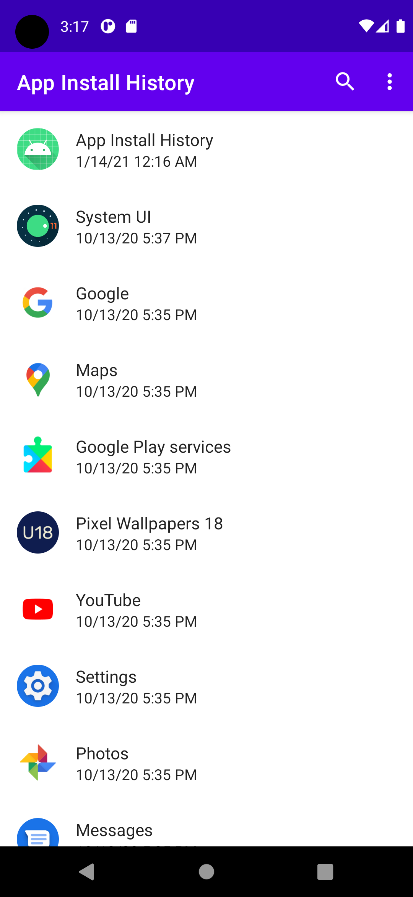
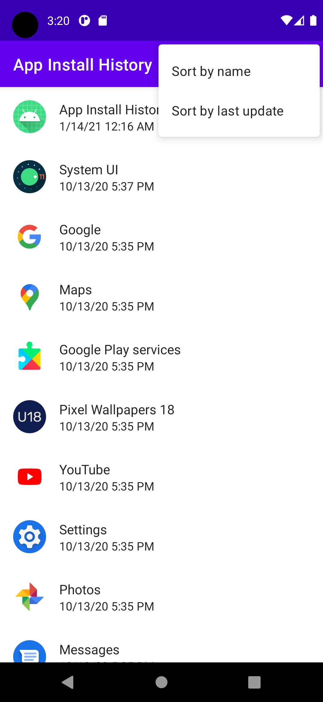
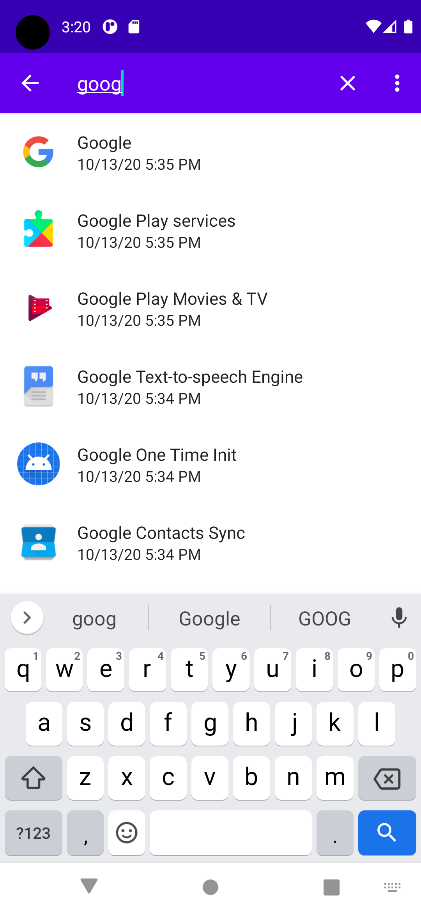

# App Install History

An Android app that lists all installed apps and their last update time, sorted
by most recently updated first.

## Motivation

Stock Android provides no way to see your most recently installed apps, which
would be very handy in some situations.

One such situation is [identifying recently installed malware][malware].

[malware]: https://www.beust.com/weblog/malware-on-my-android-phone/

## Screenshots

